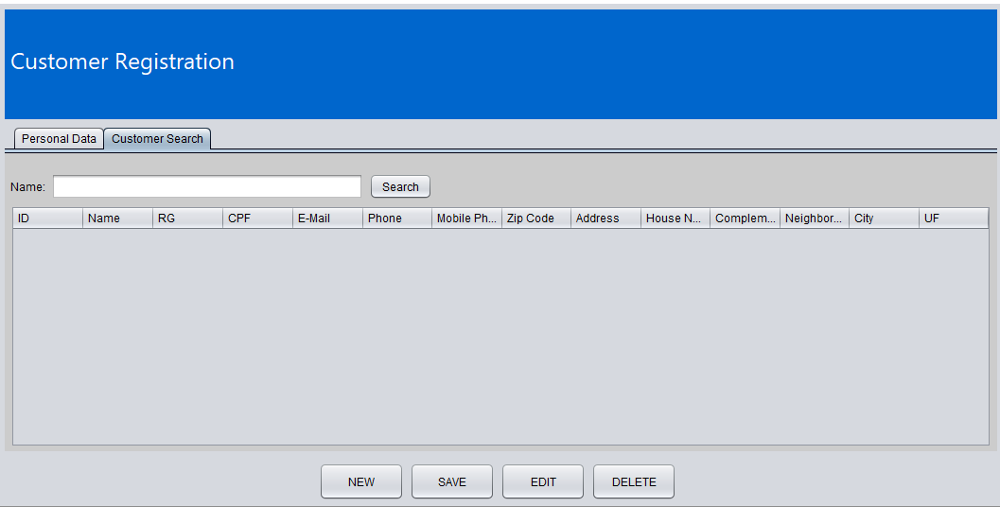

<h1>Java CRUD with MySQL Connection</h1>

This repository contains a Java project with basic CRUD (Create, Read, Update, and Delete) operations using a connection to the MySQL database.

<b><h2> Technologies used in this project:</h2></b>

* Java
* MySQL
* JDBC (Java Database Connectivity)
* Swing (Java graphical library)
* Git (version control)

<b><h2>Requirements:</h2></b>

* JDK 8 or higher
* MySQL Server 5.7 or higher
* MySQL connection library (mysql-connector-java-8.0.23.jar)

<b><h2> To use the project, follow these steps: </h2></b>

1. Download the repository in ZIP format or clone the project using the following SSH code:

    ~~~bash
    git clone git@github.com:viniciusvk1/Java-CRUD-with-MySQL-Connection.git
    ~~~

2. Open the project in your preferred IDE.

3. Import the MySQL connection library (mysql-connector-java-8.0.23.jar) into your project.

4. Create a MySQL database named "db_sales" and execute the following SQL script to create the "clients" table:

    ~~~sql
    CREATE TABLE clients (
    id INT NOT NULL AUTO_INCREMENT,
    name VARCHAR(255) NOT NULL,
    rg VARCHAR(15) NOT NULL,
    cpf VARCHAR(15) NOT NULL,
    email VARCHAR(100) NOT NULL,
    phone VARCHAR(15) NOT NULL,
    mobile VARCHAR(15) NOT NULL,
    zip_code VARCHAR(10) NOT NULL,
    address VARCHAR(255) NOT NULL,
    number INT NOT NULL,
    complement VARCHAR(255) NULL,
    neighborhood VARCHAR(100) NOT NULL,
    city VARCHAR(100) NOT NULL,
    state VARCHAR(2) NOT NULL,
    PRIMARY KEY (id)
    );
    ~~~

5. Change the database access credentials in the ConnectionFactory.java file to the credentials of your MySQL environment:

    ~~~java
    return DriverManager.getConnection("jdbc:mysql://<your_end_ip>/<your_database>", "<your_user>", "<your_password>"); 
    ~~~

6. Run the project and test the CRUD operations using the graphical interface.

<b><h1>Images of the program running</h1></b>

<h2> 1. Screenshot of the 'Personal Data' tab without modifications:</h2>
    

<h2> 2. Screenshot of the 'Customer Search' tab without modifications:</h2>

<h2>3. Inputting data for a new customer</h2>

<h2>4. Displaying the newly registered 'customer' in the Customer Search tab</h2>

<h2>5. Using the 'Edit' button to edit the data already included in the registration</h2>

<h2>6. Using the 'Delete' button to remove a customer inserted in the database</h2>

<b><h2>Open Source</h2></b>

This project is open source software under the MIT license. This means that anyone can use it, modify it, and contribute to the project. We are happy to receive contributions from the community and thank everyone who helps improve our project in advance!

* <h5> MIT License</h3>

    Copyright (c) 2023, Vinicius Almeida

    Permission is hereby granted, free of charge, to any person obtaining a copy of this software and associated documentation files (the "Software"), to deal in the Software without restriction, including without limitation the rights to use, copy, modify, merge, publish, distribute, sublicense, and/or sell copies of the Software, and to permit persons to whom the Software is furnished to do so, subject to the following conditions:

    The above copyright notice and this permission notice shall be included in all copies or substantial portions of the Software.

    THE SOFTWARE IS PROVIDED "AS IS", WITHOUT WARRANTY OF ANY KIND, EXPRESS OR IMPLIED, INCLUDING BUT NOT LIMITED TO THE WARRANTIES OF MERCHANTABILITY, FITNESS FOR A PARTICULAR PURPOSE AND NONINFRINGEMENT. IN NO EVENT SHALL THE AUTHORS OR COPYRIGHT HOLDERS BE LIABLE FOR ANY CLAIM, DAMAGES OR OTHER LIABILITY, WHETHER IN AN ACTION OF CONTRACT, TORT OR OTHERWISE, ARISING FROM, OUT OF OR IN CONNECTION WITH THE SOFTWARE OR THE USE OR OTHER DEALINGS IN THE SOFTWARE.

